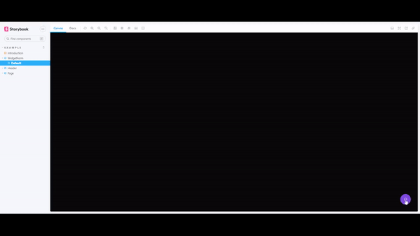

# Install and configure [Storybook](https://storybook.js.org/docs/ember/get-started/install)

## Summary

- [Install](#install)
- [Issues](#issues)
- [Configure](#configure-tailwind-with-storybook)

## Install

```sh
npx storybook init
```

## Issues

### **_Tailwind not work with Storybook_**


## Configure tailwind with storybook

1 - Install postcss

```sh
yarn add @storybook/addon-postcss
```

2 - Configure postcss in storybook

[`.storybook/main.js`](../.storybook/main.js)

```javascript
  //...
  addons: [
    //... some addons
    {
      name: "@storybook/addon-postcss",
      options: {
        postcssLoaderOptions: {
          implementation: require("postcss"),
        },
      },
    },
  ],
```

3 - Import [tailwind styles](../src/index.css)

[`.storybook/preview.js`](../.storybook/preview.js)

```javascript
import '../src/index.css'

export const parameters = {
  //... configs
}
```


